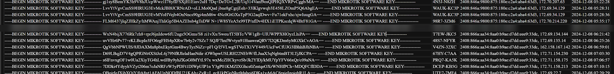

# MikroTik RouterOS Patch  [[original readme English](README_EN.md)]

## original repo [elseif/MikrotikPatch](https://github.com/elseif/MikroTikPatch)。

## The original author of the repository intentionally removed the keygen from the code, likely to prevent misuse, so I need to respect their wishes. I can generate keys for personal testing users for free.please refer to [Issue](https://github.com/FUjr/MikroTikPatch/issues/1) submit your id

## 原仓库作者有意删除了代码中的keygen,应该是不希望被滥用，因此我需要遵循他的意愿。我可以免费为个人测试用户生成.请前往[Issue](https://github.com/FUjr/MikroTikPatch/issues/1)提交software-id

## If the original author of the repository is willing to accept a merge for armhf/mmips, I would be happy to submit a PR.

## 在本仓库下载的固件，可以前往该网站自行生成key [keygen](https://keygen.fjrcn.com/)
## generate key for firmware downloaded from the repo [keygen](https://keygen.fjrcn.com/)

# 强烈谴责此用户商用行为，使用该网站一次性生成超过10个key。请各位留意二手市场中 software-id 为以下几个的（根据IP属地，发货地可能是中国贵州）

# We strongly condemn this user's commercial behavior of generating over 10 keys at once using this website. Please be aware of the following software IDs in the secondhand market (based on IP location, the shipping origin may be Guizhou, China):

